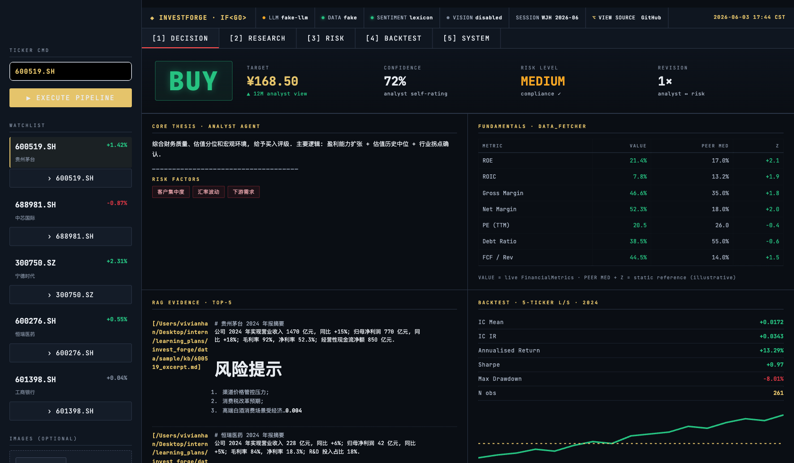
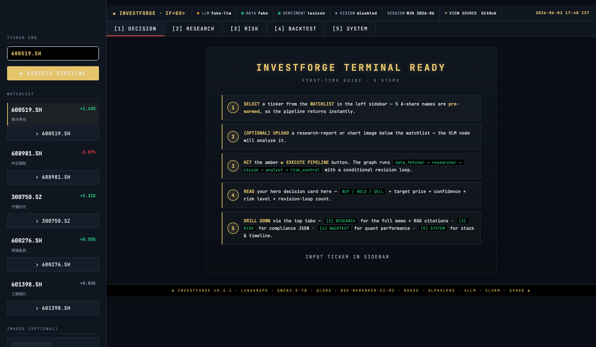
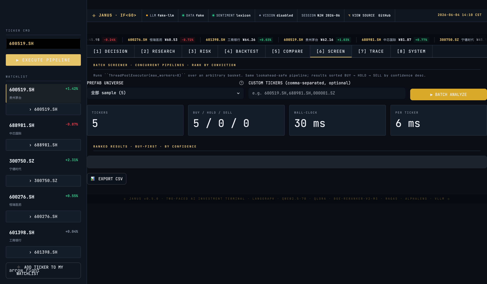
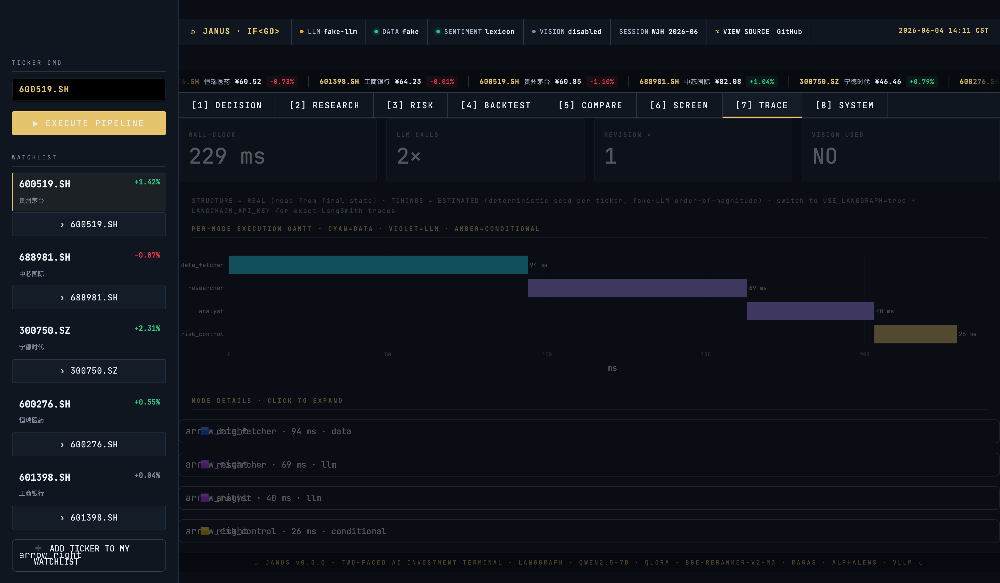
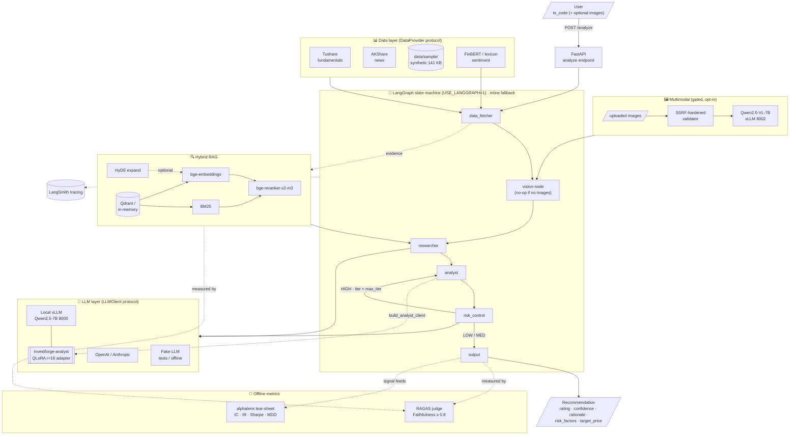

# ⌖ JANUS — The Two-Faced AI Investment Terminal

> _Looking at the past (fundamentals + RAG history) and the future (analyst forecast + target price) — like the Roman god._
>
> LangGraph Multi-Agent · Hybrid RAG · QLoRA-distilled analyst (vLLM-served) · Multimodal vision · LangSmith observable

[](https://invest-forge.streamlit.app)
[](#testing-validation)
[](#testing-validation)
[](#w3--ragas-evaluation)
[](#w4--alphalens-backtest)
[](#w2--qlora-distillation)
[](#)

---

## ✨ Live UI Preview

<p align="center">
  
  <br><sub><b>Decision view</b> — 54px mono BUY/HOLD/SELL hero · 4 KPIs · 2×2 cell-panel grid (thesis / fundamentals / RAG / K-line snapshot) · <i>captured live from <a href="https://invest-forge.streamlit.app">invest-forge.streamlit.app</a></i></sub>
</p>

<p align="center">
  
  <br><sub><b>First-time guided tour</b> — 5-step welcome card · pre-warmed cache for 5 A-share sample tickers · live ticker tape under the status bar · <i>captured from <a href="https://invest-forge.streamlit.app">invest-forge.streamlit.app</a></i></sub>
</p>

<p align="center">
  
  <br><sub><b>[6] SCREEN — batch ticker analyzer</b> · concurrent <code>ThreadPoolExecutor(max_workers=8)</code> over 6 prefab universes (白酒 / 半导体 / 新能源 / 医药 / 银行 + custom paste) · ranks BUY → HOLD → SELL by confidence · CSV export</sub>
</p>

<p align="center">
  
  <br><sub><b>[7] TRACE — observability flamegraph</b> · per-node Gantt (cyan=data · violet=LLM · amber=conditional) · click any node to inspect its live state slice · honest caveat: structure REAL, timings ESTIMATED (set <code>USE_LANGGRAPH=true + LANGCHAIN_API_KEY</code> for exact LangSmith)</sub>
</p>

> **Try JANUS live:** [`invest-forge.streamlit.app`](https://invest-forge.streamlit.app) (no setup, no API key)
> &nbsp; · &nbsp; **Run it locally:** `LLM_PROVIDER=fake python -m streamlit run frontend/app.py` → `localhost:8501`
> &nbsp; · &nbsp; **Deploy your own:** see [`docs/DEPLOY_STREAMLIT_CLOUD.md`](docs/DEPLOY_STREAMLIT_CLOUD.md)
>
> **Highlights:**
> - Bloomberg-terminal aesthetic — JetBrains Mono + amber accent, 8-tab F-key navigation
> - **K-line** with MA overlay + volume sub-panel; **streaming K-line** (3 s fragment)
> - **COMPARE** (pairwise), **SCREEN** (batch / concurrent pipelines), **AB-test mode**
> - **TRACE** observability flamegraph, **PDF report export**, **SHARE QR**
> - Watchlist URL persistence, mobile-responsive, WCAG-AA contrast verified

JANUS implements a production-grade A-share research workflow.
Input a stock ticker → the system pulls fundamentals + macro + news, runs a
data_fetcher → researcher → vision → analyst → risk_control multi-agent
pipeline with conditional revision loops, and outputs a structured
investment recommendation (BUY / HOLD / SELL + confidence + logic +
risk factors + target price).

---

## Architecture



Every external dependency (LLM, vector store, data provider, sentiment
model) sits behind a small Protocol so the *entire* pipeline runs offline
against deterministic fakes — see `tests/` and `invest_forge/llm/fake.py`.
`USE_LANGGRAPH=true` swaps the in-process inline runner for the compiled
LangGraph runtime (which is also what lets LangSmith capture traces).

---

## Layout

```
invest_forge/
├── invest_forge/
│   ├── agents/                    # state · nodes · graph · prompts
│   ├── common/                    # config · logging · types
│   ├── eval/                      # ragas_eval · quality
│   ├── knowledge_base/            # builder · retriever · pdf_loader
│   ├── llm/                       # client protocol · fake · openai · anthropic · hf (in-process)
│   └── tools/                     # data · sentiment · rag · backtest · image_input (vision security)
├── finetune/                      # QLoRA: sft_format · train_lora · eval_lora
├── frontend/                      # Streamlit dashboard (with image upload)
├── api/                           # (inside invest_forge/api/) FastAPI
├── notebooks/                     # Week 1 / 3 / 4 walkthroughs
├── configs/lora.yaml              # QLoRA hyperparameters
├── scripts/                       # generate_sample_data · build_kb · build_sft_dataset · serve_vllm.sbatch · analyze_client.sh
├── docs/                          # W2_LORA_RUNBOOK · VISION_RUNBOOK
├── data/sample/                   # synthetic 5-stock dataset (141 KB) — committed
├── tests/                         # 226 unit tests, network-free
├── docker-compose.yml             # qdrant + vllm + vllm-vision (for Docker hosts)
├── requirements-gpu.txt           # GPU dependencies (CUDA 12.x stack)
├── pyproject.toml · requirements.txt · Makefile
└── README.md
```

---

## Quick start — laptop / dev (no GPU, no API keys)

```bash
bash scripts/setup_local.sh         # venv + deps + sample + pytest
.venv/bin/streamlit run frontend/app.py
```

The dashboard runs against ``LLM_PROVIDER=fake`` (deterministic canned
responses) and reads the synthetic sample dataset.  Drop in real keys
later by editing ``.env``.

## Quick start — server (multi-GPU, CUDA 12.x)

> **Validated hardware:** 8× NVIDIA A5000-class GPUs (24 GB each), CUDA 12.x
> with the 535.x driver line. Install PyTorch from the `cu121` wheel index
> to match this stack.

```bash
bash scripts/server_migrate.sh      # idempotent; ~5 min on a fast link

# Install GPU stack (cu121 wheels):
pip install -r requirements-gpu.txt \
    --extra-index-url https://download.pytorch.org/whl/cu121

# After it finishes:
#   • conda env 'invest_forge' (Py 3.11)
#   • core deps + GPU stack (gated on nvidia-smi) installed
#   • Qdrant running on :6333
#   • .env scaffolded — fill OPENAI_API_KEY / ANTHROPIC_API_KEY / TUSHARE_TOKEN

make api          # FastAPI on :8001
make dashboard    # Streamlit on :8501
```

> **No model weights are downloaded by ``server_migrate.sh``.**
> Pull them manually after editing ``.env``:
> ```bash
> huggingface-cli login
> huggingface-cli download Qwen/Qwen2.5-7B-Instruct
> ```

### Self-hosted vLLM serving (Qwen2.5-7B + `investforge-analyst` LoRA)

On a **Docker host**: `docker compose --profile vllm up -d`.

On a **SLURM cluster** (no Docker / no sudo), serve via the bundled job
script — run vLLM in its **own conda env** (it pins its own torch /
transformers, so it must not share the `invest_forge` training env):

```bash
# one-time: a dedicated serving env
conda create -n vllm python=3.11 -y && conda activate vllm
pip install "vllm==0.6.3.post1" "transformers==4.46.3"

# submit the server (handles chat-template + lm-format-enforcer backend):
sbatch scripts/serve_vllm.sbatch                 # tail -f vllm_<jobid>.log
# run the full agent on the SAME node (LoRA analyst + base researcher/risk):
srun --jobid=<jobid> --overlap --pty bash
bash scripts/analyze_client.sh 688981.SH
```

> See [`docs/W2_LORA_RUNBOOK.md`](docs/W2_LORA_RUNBOOK.md) for the full
> fine-tuning workflow, GPU/port allocation notes, and SLURM serving recipe.
> Validated end-to-end: the temperature-augmented, retrained
> `investforge-analyst` adapter serves the analyst node and `/analyze`
> returns a full BUY/HOLD/SELL recommendation (rating · confidence ·
> rationale · risk_factors · target_price).

---

## Multimodal vision (report / chart images)

JANUS can analyse research-report screenshots, K-line charts, and
financial diagrams by routing them through a dedicated vision VLM
(`Qwen/Qwen2.5-VL-7B-Instruct`) served at a separate vLLM endpoint.

**The feature is INERT by default** — set `LOCAL_VISION_MODEL` in `.env` to
activate it.  When unset, the pipeline behaves exactly as before.

```bash
# POST a base64-encoded PNG alongside the ticker:
curl -X POST http://localhost:8001/analyze \
  -H "Content-Type: application/json" \
  -d '{"ts_code":"688981.SH","images":[{"kind":"base64","value":"<B64>"}]}'
```

Images are validated by a SSRF-hardened security layer before any processing:
https-only URLs, IP-pinned fetching (no DNS rebinding), decompression-bomb
guards, and a format allowlist (PNG / JPEG / WEBP).  Local file paths are
**disabled by default** (`VISION_ALLOW_LOCAL_PATHS=false`).

See [`docs/VISION_RUNBOOK.md`](docs/VISION_RUNBOOK.md) for the full setup,
boot commands, and security model.

---

## Environment variables (`.env.example`)

| Key                              | Purpose                                            |
|----------------------------------|----------------------------------------------------|
| `OPENAI_API_KEY` / `ANTHROPIC_API_KEY` / `GEMINI_API_KEY` | Pick one for the LLM layer |
| `LOCAL_LLM_BASE_URL` / `LOCAL_LLM_MODEL` | Use a self-hosted vLLM endpoint (`Qwen/Qwen2.5-7B-Instruct`) |
| `LOCAL_ANALYST_MODEL`            | LoRA adapter name for the analyst node (`investforge-analyst`); other nodes use the base model |
| `LOCAL_VISION_BASE_URL` / `LOCAL_VISION_MODEL` | Vision VLM endpoint + model (`Qwen/Qwen2.5-VL-7B-Instruct`); leave blank to disable vision |
| `VISION_ALLOW_LOCAL_PATHS`       | `false` (safe default) — set `true` only in trusted environments |
| `VISION_MAX_IMAGES` / `VISION_MAX_BYTES` / `VISION_MAX_PIXELS` | Image input policy |
| `LORA_ADAPTERS_DIR` / `LORA_ADAPTER_PATH` | Host adapter dir + in-container adapter path for docker-compose |
| `LLM_PROVIDER`                   | `fake` (default) / `openai` / `anthropic` / `local` |
| `TEACHER_LLM_PROVIDER` / `TEACHER_OPENAI_API_KEY` | Teacher model for SFT dataset distillation |
| `TUSHARE_TOKEN`                  | Real fundamental + news data on the server         |
| `QDRANT_URL` / `QDRANT_COLLECTION` | Production knowledge-base location              |
| `EMBEDDING_MODEL` / `RERANKER_MODEL` | bge-small-zh + bge-reranker-v2-m3              |
| `LANGCHAIN_TRACING_V2` / `LANGCHAIN_API_KEY` | LangSmith observability             |

`.env` is git-ignored; only `.env.example` is checked in.

---

## Tests

226 pytest unit tests, fully network-free, cover:

* domain enums + lenient rating parsing
* config loader edge cases (missing env, bad int)
* lexicon sentiment scorer
* fake LLM dispatch + handler-priority ordering · in-process HF provider wiring
* hybrid retriever (BM25, HyDE, reranker), recursive chunking
* every agent node (researcher / analyst / risk-control / vision / output)
* end-to-end pipeline including conditional revision loop + iteration cap
* lookahead-bias-safe signal + simple / cross-sectional backtest + 5-ticker panel loader / MultiIndex factor builder (alphalens-ready)
* heuristic quality scorer + RAGAS (stub + real-judge runner, eval-set loader, faithfulness gate)
* SFT dataset distillation + train/serve prompt parity
* temperature-augmented distillation (sample ladder, full-identity dedup, prompt-parity)
* LangGraph runtime end-to-end + graph/inline parity (runs on server; skipped when langgraph absent)
* SSRF-hardened image-input validator (IP pinning, path traversal, bombs)
* multimodal vision wiring (ChatMessage images, vision node gating)

```bash
pytest -q
```

---

## Roadmap & measured deliverables

**W2 — QLoRA distill of Qwen2.5-7B analyst + vLLM adapter serving** ✅
- Rating accuracy: **0.867 → 0.900** (+3.3 pp)
- Confidence MAE: **0.0283 → 0.0200** (−29%)
- Eval: 30 held-out examples drawn from a 200-row temperature-augmented distill corpus
- Served end-to-end via vLLM at `/analyze` on a SLURM-managed GPU node
- Details: [`docs/W2_LORA_RUNBOOK.md`](docs/W2_LORA_RUNBOOK.md)

**W3 — Hybrid RAG + RAGAS Faithfulness gate (target ≥ 0.8)** ✅
- RAGAS pilot (n = 6, Qwen2.5-7B as judge): **Faithfulness 1.00, context_precision 1.00, context_recall 1.00** → gate PASS
- Real RAGAS runner + judge wiring committed; scaling to a larger eval set is the next step

**W4 — 5-ticker end-to-end + alphalens backtest dashboard** ✅
- 2024 sample (261 trading days, 5 tickers): IC **0.0172** / IC-IR **0.0343** / annualised return **+13.29%** / Sharpe **0.97** / MDD **−8.01%**
- alphalens tear-sheet wired (`scripts/run_backtest.py --alphalens`); dashboard expander shipped

---

## License

MIT.  © 2026 JANUS contributors.
